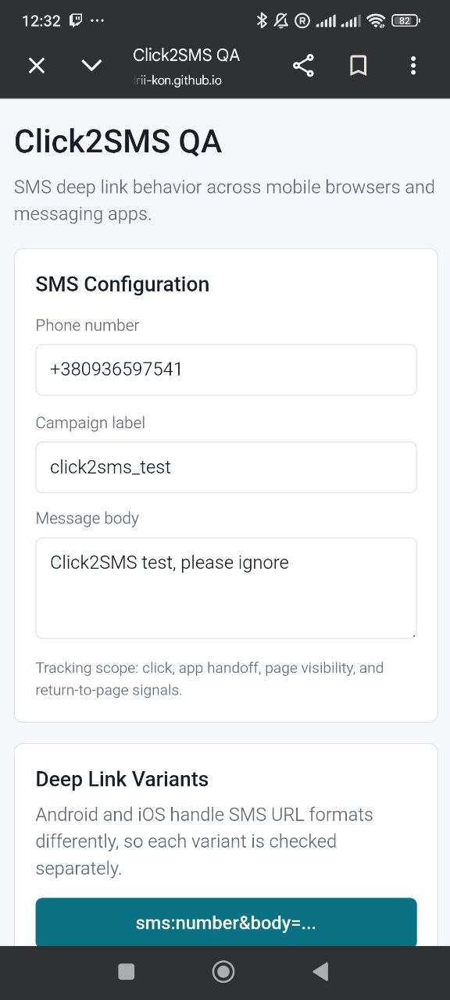
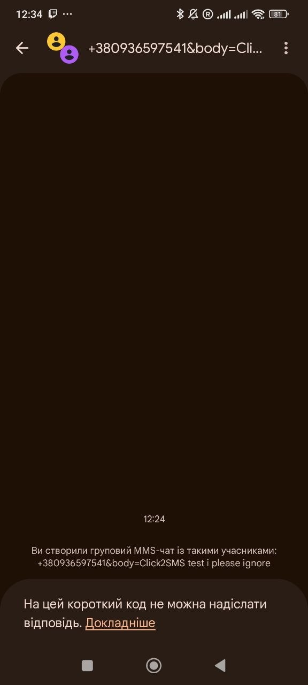
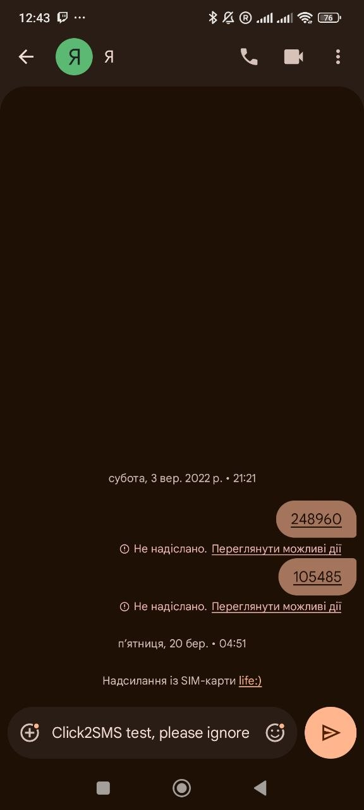
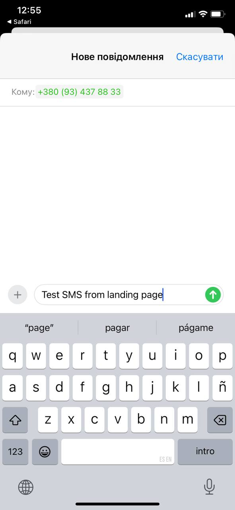
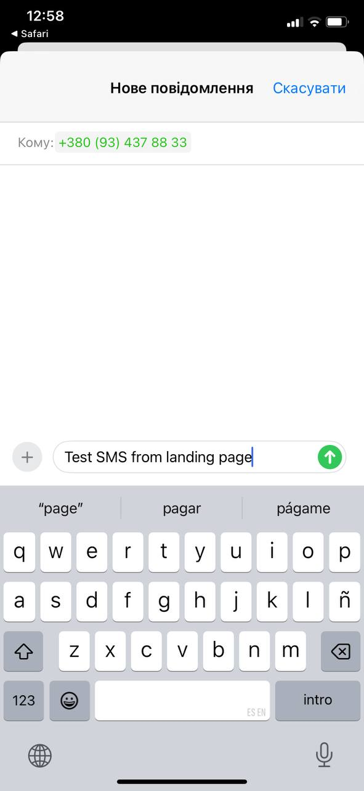
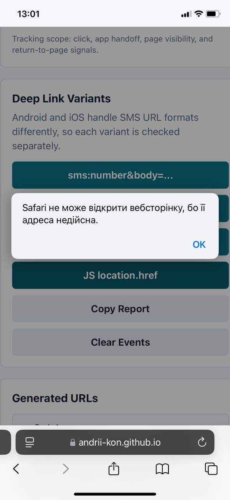

# Click2SMS QA звіт

Дата тесту: `06.05.2026`  
Тестовий ленд: https://andrii-kon.github.io/click2sms-test/

## Мета

Перевірити, як працює перехід з ленду в SMS-додаток з наперед заданим номером і текстом, а також зрозуміти:

- чи повертає користувача автоматично назад на ленд;
- які browser events спрацьовують під час переходу і повернення;
- які `gtag` події можна повісити для аналітики;
- який SMS URL формат краще використовувати на Android та iPhone.

## Короткий висновок

Рекомендований універсальний формат:

```text
sms:+PHONE?body=ENCODED_TEXT
```

Наприклад:

```text
sms:+380936597541?body=Click2SMS%20test%2C%20please%20ignore
```

Причина:

- на Android Chrome цей формат коректно відкрив SMS app, підставив номер і текст;
- на iPhone Safari цей формат також коректно відкрив Messages, підставив номер і текст;
- `smsto:` на iPhone Safari не працює;
- `sms:number&body=...` на Android Chrome працює некоректно, бо `&body=...` потрапляє в recipient.

## Що можна і не можна трекати

Можна трекати з ленду:

- клік по SMS-кнопці: `sms_click`;
- втрату фокусу / перехід з браузера: `window_blur`, `visibilitychange: hidden`;
- повернення користувача на ленд: `window_focus`, `visibilitychange: visible`;
- кастомні `gtag` події повернення: `sms_return_to_landing`, `sms_return_focus`.

Не можна надійно трекати з ленду:

- факт реального відправлення SMS.

Пояснення: після відкриття native SMS app браузер не отримує callback типу `sms_sent`. Ленд бачить тільки клік, вихід зі сторінки і повернення назад.

## Повернення на ленд

Автоматичного повернення на ленд після відкриття SMS app у тестах не зафіксовано.

Користувач повертається вручну:

- через кнопку Back / Назад;
- через Safari back;
- через app switcher.

Після ручного повернення ленд може зафіксувати це через `focus` / `visibilitychange` і відправити `gtag` подію повернення.

## Рекомендовані gtag події

```js
gtag('event', 'sms_click', {
  event_category: 'sms',
  method: 'sms_body_question',
  sms_url_scheme: 'sms',
  phone: phone
});
```

```js
gtag('event', 'sms_return_to_landing', {
  event_category: 'sms',
  method: 'sms_body_question',
  seconds_since_sms_click: secondsSinceClick
});
```

```js
gtag('event', 'sms_return_focus', {
  event_category: 'sms',
  method: 'sms_body_question',
  seconds_since_sms_click: secondsSinceClick
});
```

Практично достатньо:

- `sms_click` як основна конверсія “натиснув відправити SMS”;
- `sms_return_to_landing` або `sms_return_focus` як допоміжна подія “повернувся на ленд”.

## Android Chrome

Статус: протестовано.

| Формат | SMS app відкрився | Номер підставився | Текст підставився | Повернення | Tracking events | Висновок |
| --- | --- | --- | --- | --- | --- | --- |
| `sms:number&body=...` | Так | Ні | Ні | Вручну, зафіксовано через ~3с | Так | Не підходить для Android |
| `sms:number?body=...` | Так | Так | Так | Вручну, зафіксовано через ~45с | Так | Найкращий Android варіант |
| `smsto:number?body=...` | Так | Так | Так | Вручну, зафіксовано через ~31с | Так | Працює, але показав chooser вибору SMS app |
| `JS location.href` через `smsto:` | Так | Так | Так | Вручну, зафіксовано через ~54с | Так | Поведінка така сама як `smsto:` |

### Android висновок

Для Android Chrome найкраще спрацював:

```text
sms:number?body=...
```

Формат:

```text
sms:number&body=...
```

працює некоректно: Android SMS app сприйняв `&body=...` як частину отримувача/чату.

## iPhone Safari

Статус: протестовано.

| Формат | Messages відкрився | Номер підставився | Текст підставився | Повернення | Tracking events | Висновок |
| --- | --- | --- | --- | --- | --- | --- |
| `sms:number&body=...` | Так | Так | Так | Вручну, зафіксовано через ~52с | Так | Працює |
| `sms:number?body=...` | Так | Так | Так | Вручну, зафіксовано через ~28с | Так | Працює |
| `smsto:number?body=...` | Ні | N/A | N/A | Залишився на ленді | Частково, тільки клік | Не працює |
| `JS location.href` через `smsto:` | Ні | N/A | N/A | Залишився на ленді | Частково, тільки клік | Не працює |

### iPhone висновок

На iPhone Safari працюють обидва `sms:` формати:

```text
sms:number&body=...
sms:number?body=...
```

Але `smsto:` не працює. Safari показує помилку:

```text
Safari не може відкрити вебсторінку, бо її адреса недійсна.
```

## Фінальна рекомендація

Використовувати:

```text
sms:+PHONE?body=ENCODED_TEXT
```

Цей формат пройшов тест і на Android Chrome, і на iPhone Safari.

JS-перехід через `window.location.href` не дав переваги. Якщо URL той самий, поведінка така сама, як у звичайного `<a href="...">`.

## Скріншоти

### Android Chrome, початковий стан ленду



### Android Chrome, некоректний `sms:number&body=...`

На Android цей формат відкрив SMS app, але `&body=...` потрапив у recipient/чат.



### Android Chrome, коректний `sms:number?body=...`

Номер і текст підставились коректно.


### Android Chrome, `smsto:number?body=...`

Після вибору SMS-додатку номер і текст підставились коректно.



### Android Chrome, `JS location.href`

Поведінка така сама, як у `smsto:number?body=...`: Android показав chooser перед відкриттям SMS app.

Файл скріншота ще треба додати, якщо потрібне окреме зображення:

```text
screenshots/android-chrome-js-location-result.jpg
```

### iPhone Safari, коректний `sms:number&body=...`

Номер і текст підставились коректно.



### iPhone Safari, коректний `sms:number?body=...`

Номер і текст підставились коректно.



### iPhone Safari, помилка для `smsto:`

Safari не відкрив `smsto:` URL і показав помилку про недійсну адресу.



## Технічний appendix: які events спрацьовували

### Типова послідовність на Android Chrome

При успішному відкритті SMS app:

```text
gtag:sms_click
beforeunload
window_blur
visibilitychange hidden
```

Після ручного повернення на ленд:

```text
visibilitychange visible
gtag:sms_return_to_landing
window_focus
gtag:sms_return_focus
```

Приклад з Android Chrome для `sms:number?body=...`:

```text
2026-05-06T10:39:34.721Z gtag:sms_click method=smsBodyQuestion
2026-05-06T10:39:34.741Z beforeunload
2026-05-06T10:39:34.804Z window_blur
2026-05-06T10:39:35.749Z visibilitychange hidden
2026-05-06T10:40:19.915Z visibilitychange visible
2026-05-06T10:40:19.960Z gtag:sms_return_to_landing seconds_since_sms_click=45
2026-05-06T10:40:20.002Z window_focus
```

### Типова послідовність на iPhone Safari

iPhone Safari поводився трохи інакше: іноді перед повним переходом з’являвся ранній `focus`, але фінальне повернення все одно можна було зафіксувати.

При успішному відкритті Messages:

```text
gtag:sms_click
window_blur
window_focus
gtag:sms_return_focus
window_blur hidden
visibilitychange hidden
```

Після ручного повернення на ленд:

```text
window_focus
gtag:sms_return_focus
visibilitychange visible
gtag:sms_return_to_landing
```

Приклад з iPhone Safari для `sms:number?body=...`:

```text
2026-05-06T10:58:37.396Z gtag:sms_click method=smsBodyQuestion
2026-05-06T10:58:37.515Z window_blur
2026-05-06T10:58:38.668Z window_focus
2026-05-06T10:58:38.668Z gtag:sms_return_focus seconds_since_sms_click=1
2026-05-06T10:58:39.731Z window_blur hidden
2026-05-06T10:58:39.739Z visibilitychange hidden
2026-05-06T10:59:05.476Z window_focus
2026-05-06T10:59:05.566Z gtag:sms_return_focus seconds_since_sms_click=28
2026-05-06T10:59:05.626Z visibilitychange visible
2026-05-06T10:59:05.626Z gtag:sms_return_to_landing seconds_since_sms_click=28
```

### Висновок по events

Для `gtag` краще не покладатися тільки на один browser event, бо Android Chrome і iPhone Safari дають різну послідовність.

Практичний підхід:

- на клік одразу відправляти `sms_click`;
- запам’ятовувати timestamp кліку;
- на `visibilitychange` у `visible` і/або `window_focus` після SMS-кліку відправляти return event;
- додавати `seconds_since_sms_click`, щоб розуміти, як швидко користувач повернувся.
